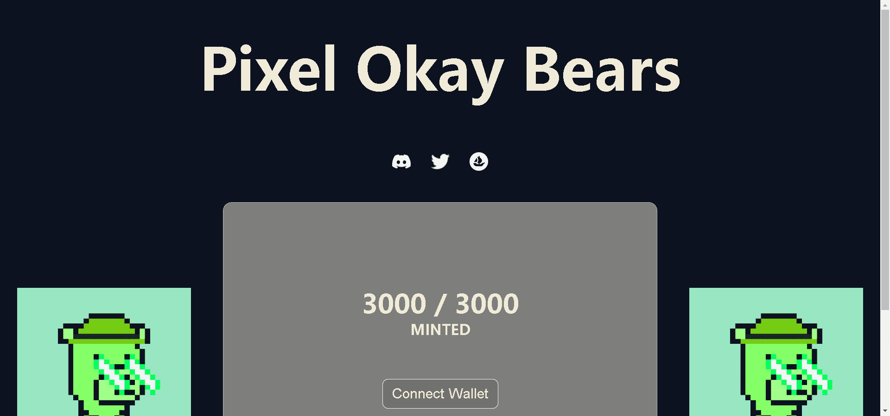

# Pixel Okay Bears Collective

3000 Pixel Okay Bears 是 Solana 的 Okay Bears 的以太坊衍生产品，它们没有任何关联。我们只是向最初的 Okay Bears 致敬的卓越区块链上的卓越艺术风格......

▶ 什么是 Pixel Okay Bears 集体？
Pixel Okay Bears Collective 是一个 NFT（不可替代令牌）集合。存储在区块链上的数字艺术品集合。

▶ Pixel Okay Bears Collective 代币有多少？
总共有 3,000 个 Pixel Okay Bears 集体 NFT。目前，344 位所有者的钱包中至少有一个 Pixel Okay Bears Collective NTF。

▶ Pixel Okay Bears Collective 最贵的促销是什么？
出售的最昂贵的 Pixel Okay Bears Collective NFT 是 Pixel Okay Bears Collective #126。它于 2022-06-07（3 个月前）以 1.6 美元的价格售出。

