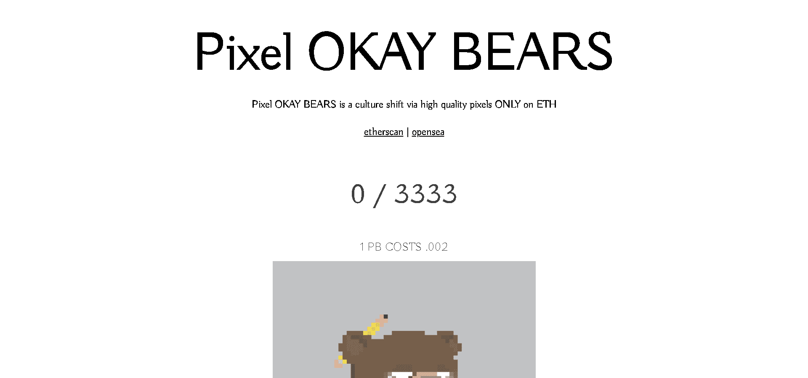

# Pixel OKAY BEARS

Pixel OKAY BEARS 是源自 SOL 的 OKAY BEARS 的衍生产品。ETH 至高无上，我们认为最好为大众提供一个 hq 像素熊。

▶ 什么是像素 OKAY BEARS？
Pixel OKAY BEARS 是一个 NFT（不可替代令牌）集合。存储在区块链上的数字艺术品集合。

▶ Pixel OKAY BEARS 代币有多少？
总共有 3,333 个 Pixel OKAY BEARS NFT。目前，291 位所有者的钱包中至少有一个 Pixel OKAY BEARS NTF。

▶ Pixel OKAY BEARS 最贵的促销是什么？
售出的最昂贵的 Pixel OKAY BEARS NFT 是 Pixel OKAY BEARS #1047。它于 2022-06-18（2 个月前）以 1 美元的价格出售。

