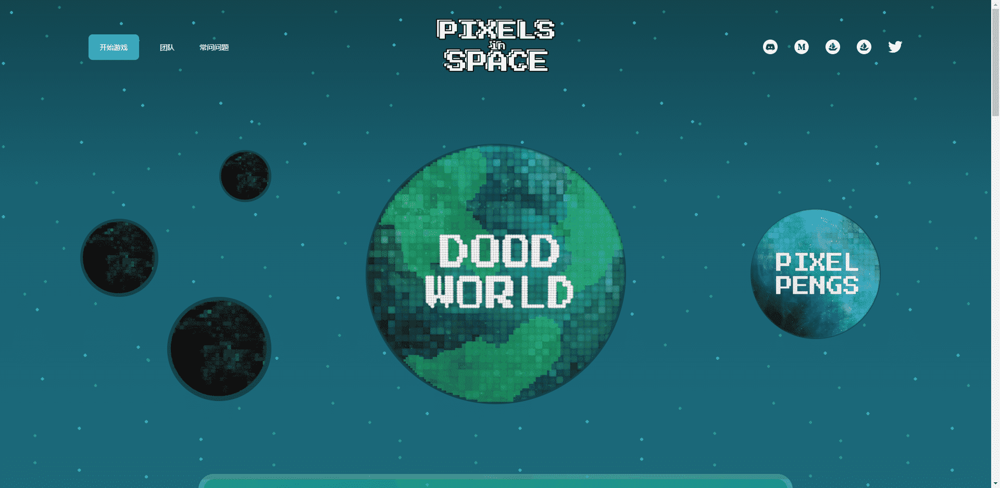

# Pixel Pengs

Pixel Pengs 是一个 10,000 个数字绘制的 NFT 集合，生活在以太坊区块链的北极。持有 Pixel Pen 让您有机会赢得令人难以置信的奖品并访问 Pixels in Space 游戏。

Pixels In Space 是一个由不同 NFT 集合组成的宇宙。在 Pixels In Space 中，每个 NFT 集合都将具有与 Pixels In Space 游戏相关的特定特权和好处。

Pixels In Space 游戏是一款空闲冒险 RPG（角色扮演游戏），您可以在其中发送您的 NFT 来执行产生奖励的任务。类似于 WoW Garrison 任务，或失落的方舟要塞历险记

通过玩 Pixels In Space 游戏，您将在每次完成任务时获得游戏内代币。然后可以将这些代币用于游戏内物品、能量提升、白名单抽奖条目、NFT 抽奖条目，甚至现实世界的物品！可能性是无止境！

