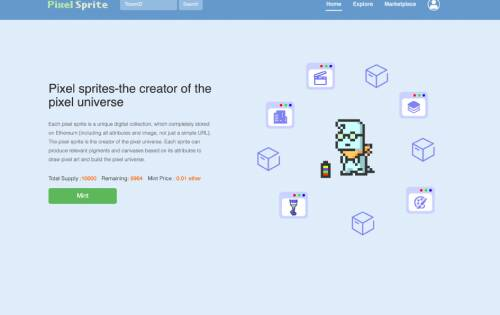
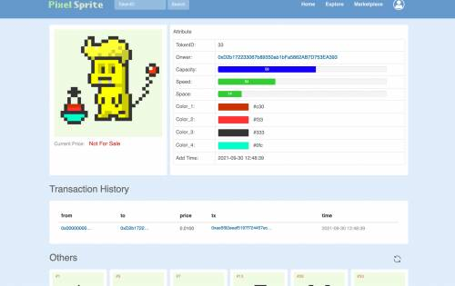

# Pixel Sprite

像素精灵是一个独特的数字集合，它完全存储在以太坊上（包括所有属性和图像，而不仅仅是一个简单的 URL）。像素精灵是像素宇宙的创造者。每个精灵都可以根据其属性产生相关的颜料和画布，以绘制像素艺术并构建像素宇宙。

每个像素精灵都完全存储在以太坊上。他们是颜料矿工和帆布织工。铸造一个像素精灵，让它们为你工作以赚取以太币。

所有精灵数据（包括精灵属性和精灵图像）都通过我们的算法压缩并存储在智能合约中。你所拥有的是一个完全存储在区块链上的精灵，而不是一个可以随意修改的 URL。

精灵可以根据它们的属性产生不同的颜料和画布。

像素宇宙中只有 10,000 个精灵。他们只能生产有限的颜料和画布。然而，对颜料和画布的潜在需求是巨大的。一幅 20*20 像素的作品需要消耗一张画布和大约 300 种颜料。许多像素艺术家正在等待出售您的颜料和画布。

随着对颜料和画布需求的增加，雪碧将变得越来越有价值。

