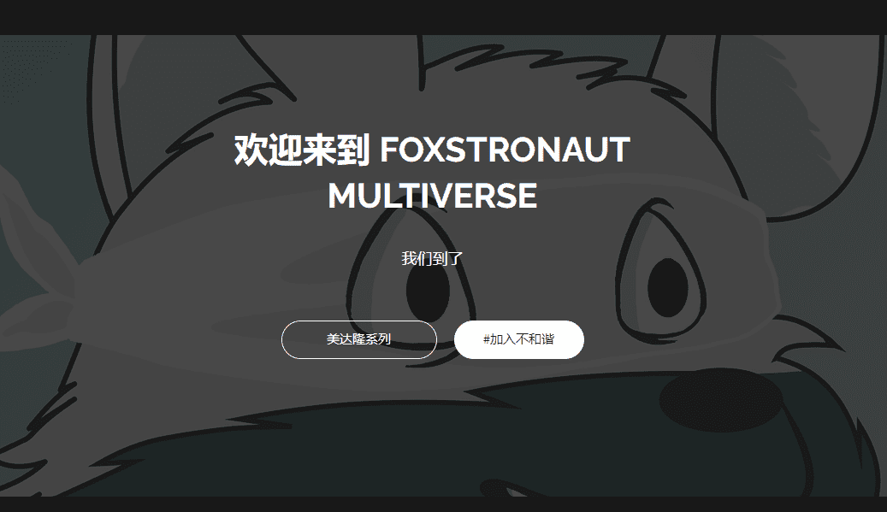

# Pixelated Foxstronauts

Foxstronaut Multiverse 已经扩展了 Harmony One 区块链和多边形链的区块链多元宇宙。仍在寻找神奇的以太。 

这个系列将看到 Foxstronauts 拥有新的套装、头饰、武器和外观。拥有超过 20 种不同的属性，特征组合是无穷无尽的。  

狐狸象征着聪明、狡猾，被称为骗子。在其他文化中，狐狸被视为精神向导，帮助您在精神世界中导航。狐狸是灵性、创造、预兆和来世的象征。

Pixelated Foxstronauts 是作为 10,000 个项目生成 NFT 集合创建和执行的。它们是 Polygon 网络上的 ERC-721 代币。该项目是作为一种学习体验来执行的，以进一步加深我们对区块链、NFT 和整个 MATIC 网络的了解。 

每个 Pixelated Foxstronaut 都与 OpenSea.io 的“Pixelated Foxstronauts”集合相关联。它们具有相似的特征，但稀有数据与 Foxstronaut V2 合集不同。

