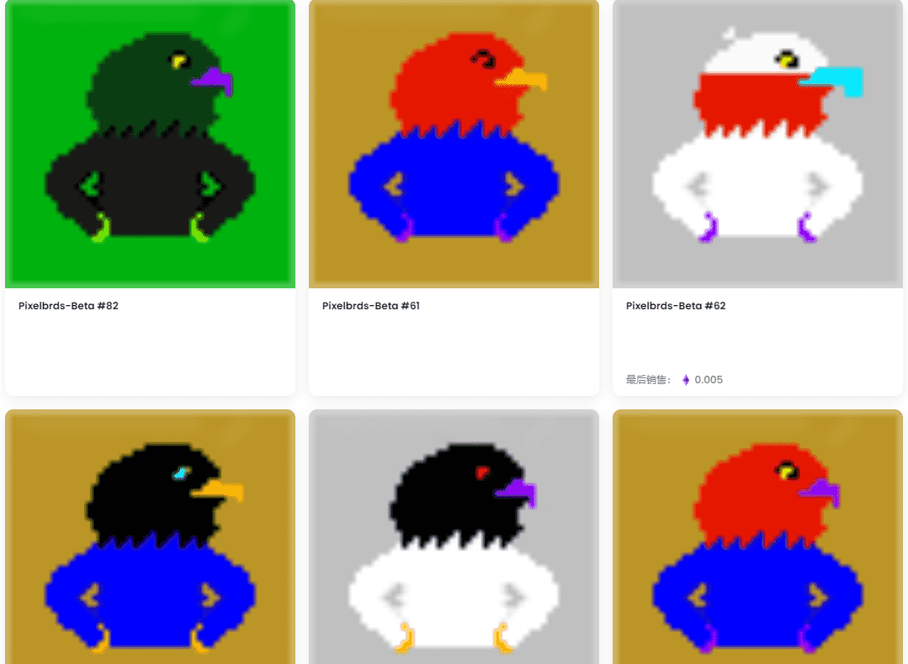

# Pixelbrds-Beta

这个集合的目的主要是为了测试，只是简单的快速创建的鸟。但是，如果出售此系列，100% 的收益将捐赠 以帮助受乌克兰当前战争影响的儿童。如果一个人在 3 月 30 日之前拥有 Pixelbrds-Beta，他们将被列入即将到来的实际项目的白名单。这个测试项目的目的。

什么是 Pixelbrds-Beta？

Pixelbrds-Beta 是一个 NFT（Non-fungible token）集合。存储在区块链上的数字艺术品集合。

有多少个 Pixelbrds-Beta 代币？

总共有 113 个 Pixelbrds-Beta NFT。目前 3 位所有者的钱包中至少有一个 Pixelbrds-Beta NTF。

最近卖出了多少 Pixelbrds-Beta？

过去 30 天内售出了 0 个 Pixelbrds-Beta NFT。

