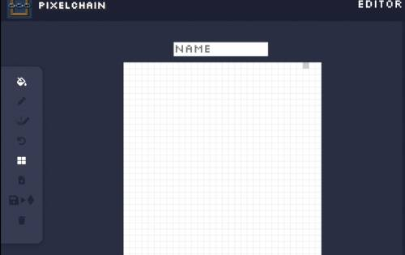

# PixelChain

Pixelchain 是一个去中心化的应用程序，它允许用户创建 32x32 像素艺术并将其 100% 存储在区块链上，它将永远存在。每件艺术品都是独一无二的，并被编码到 ERC-721 令牌中。立即加入 Pixelchain，开始创作和收集不可变的像素艺术。

如今，大多数 NFT 和 CryptoArtworks 都有相同的问题，即图像是离线存储的。如果存储数据的项目死亡，艺术品的图形信息很可能会丢失。

将所有艺术品信息和元数据存储在链上解决了这个问题。
现在，您可以在链上 100% 创作和存储艺术品，这些艺术品将永远存在。

当 PixelChain 被铸造时，我们的创新者智能合约将对所有图像数据进行编码、压缩并将其发送到区块链，并与名称和作者信息一起存储在区块链中。

之后，这些数据始终可以直接从区块链访问，由我们的开源解码器解压缩和解码，以重建艺术家创建的原始图像。

