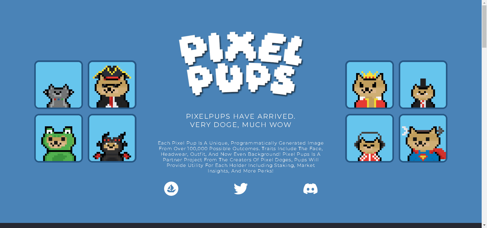

# Pixel Doge Pups

每个 Pixel Pup 都是一个独特的、通过 100,000 多个可能结果以编程方式生成的图像。特征包括面部、头饰、服装，现在甚至包括背景！Pixel Pups 是 Pixel Doges 的创建者的合作项目，Pups 将为每个持有者提供实用程序，包括 Staking、市场洞察力和更多福利！

Pixel Doges 是我们帮助建立核心社区的第一个系列。Pixel Doge Pups 的目标是将项目的方向转变为一个负担得起的社区，持有者可以在这里学习他们需要知道的一切，以便在当前的 NFT 环境中茁壮成长。

