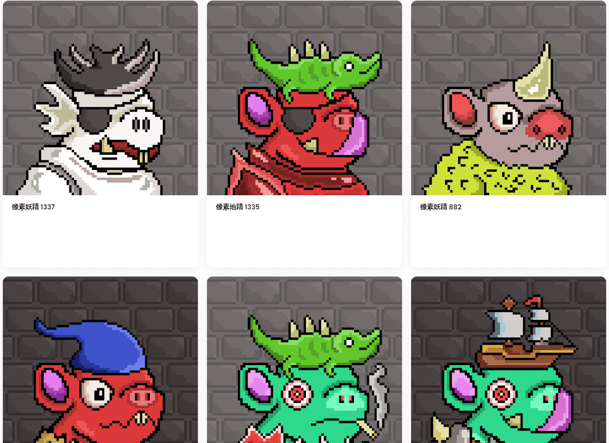

# Pixel Goblins Town

我们以 0.001 的折扣房价重新打开了薄荷糖。地板目前是 0.003。我认为地精现在可以负担得起他们选择的任何地方！时间有限，时钟滴答作响。0.001 薄荷！

什么是像素地精小镇？

Pixel Goblins Town 是一个 NFT（Non-fungible token）集合。存储在区块链上的数字艺术品集合。

像素哥布林镇代币有多少？

总共有 2,257 个 Pixel Goblins Town NFT。目前，173 位所有者的钱包中至少有一个 Pixel Goblins Town NTF。

像素哥布林小镇最近卖出了多少？

过去 30 天内共售出 0 个 Pixel Goblins Town NFT。

