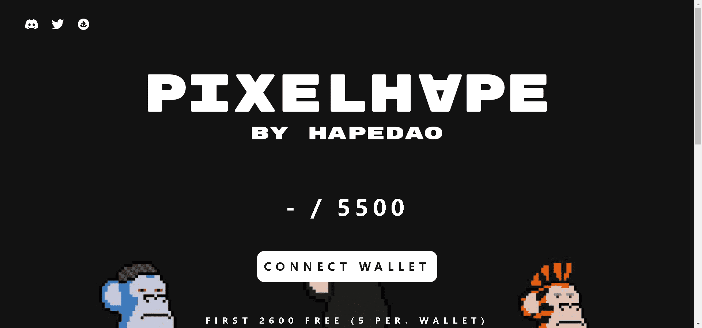

# Pixel HAPE

灵感来自 Genesis HAPE 系列的 5500 像素 HAPE。每个 NFT 都是 HAPEDAO 中的一个席位 - 即将成为 HAPEBEAST NFT 的最大持有者。

500 像素 HAPE灵感来自 Genesis HAPE 系列的 100 多个特征。
每个 NFT 都是 HAPEDAO 中的一个席位-即将成为 HAPEBEAST NFT 的最大持有者。

HAPEDAO将使用20% 的主要收入和80% 的所有二次特许权使用费来购买 HAPEBEAST。

持有者可以决定 DAO 如何处理资产。将举行投票以决定未来的购买、社区抽奖和用于分割 DAO 资产的 $HAPE 代币的代币经济学。

