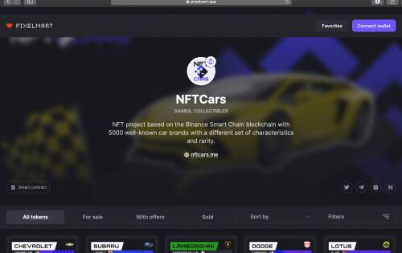
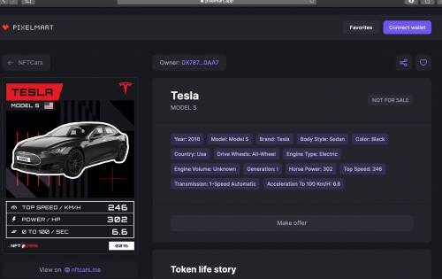

# PixelMart

最近，我们的团队正在制作我们自己的 NFT 收藏，我们面临着一些不想上架我们的网站的不公正待遇。或者我们意识到我们可以使市场比其他市场更好，并推出了这个网站。我们对任何数字创作者和收藏开放，我们不关心版权或他们所说的“只是另一个 NFT”之类的东西。与那些创造美好事物的人一起工作对我们来说很有趣，新的数字世界将与像你这样的人一起工作。

不久前，我们正在制作我们自己的 NFT 集合，我们面临着一些不想列出我们的网站的侮辱性面孔。这就是我们意识到我们可以并且需要使市场比其他市场更好并启动这个项目的方式。

我们有一条规则，我们对任何数字创意和所有收藏都持开放态度。我们不关心版权之类的东西，我们认为任何变成 NFT 并花费了某人时间的东西都应该上市。在这里没有人会称一个集合：“只是另一个 NFT”。

与那些构建新数字世界、创造独特事物的人合作对我们来说很有趣。

