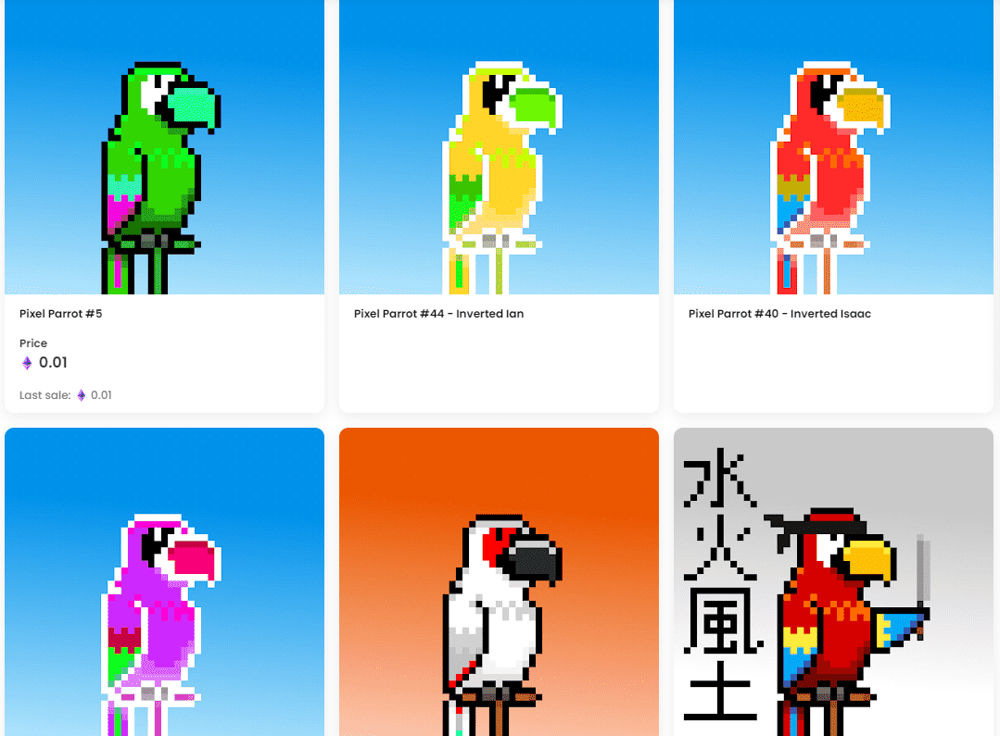

# pixelparrots.wtf

Pixel Parrots 是一个独特的 8 位像素艺术集合。每个角色都是单独设计的，考虑到额外的质量和关怀。

没有一只像素鹦鹉是相同的，每只鹦鹉都有其独特的个性和风格。因此，通过购买像素鹦鹉，您将拥有一件独一无二的像素艺术作品。

只会创建 250 只像素鹦鹉。因此，尽早获取您的像素鹦鹉，以在它们持续的同时充分利用它们的便宜价格！

每天都会添加更多内容，请多多关注

什么是像素鹦鹉？

Pixel Parrots 是一个 NFT（Non-fungible token）集合。存储在区块链上的数字艺术品集合。

Pixel Parrots 代币有多少？

总共有 44 个 Pixel Parrots NFT。目前，159 位车主的钱包中至少有一只 Pixel Parrots NTF。

最近卖出了多少只像素鹦鹉？

过去 30 天内共售出 0 个 Pixel Parrots NFT。

