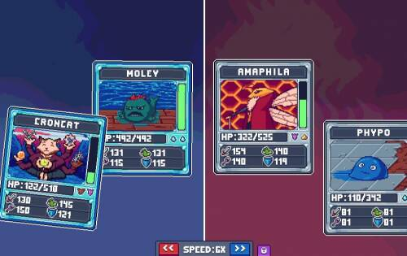

# Pixelpets

PixelPets 是一款用于宠物交易和战斗的 NFT 游戏。每个令牌代表总共 60 种不同宠物类型中的一种。每只宠物都有特定的稀有类型（普通、稀有、史诗或传奇），这会影响它们在质量和等级等其他属性下的强度。它通过内置的宠物市场结合了“收集赚钱”/“玩赚钱”的概念，并通过为期几天的持续锦标赛以及每周运行的最佳玩家的奖池。

Chain Team Tactics 是一款基于 nft 的 pvp 战斗模拟器。

收集至少 6 个单位并开始与其他玩家战斗！
每场战斗都以三局两胜的方式进行，每轮开始玩家都会更换。
为了让它更辣，你将争夺你的 PXT 股份（测试版之后）。

Chain Team Tactics 测试版于 2022 年 5 月30日在主网上启动。Beta 版将持续大约 6-8 周。可以预期，在测试期间将发生重大变化和一些错误修正。

公测结束后，奖励将分配给排行榜前50名的玩家。公测期间不会有任何奖励，因此我们将在公测结束时将一些 NFT 分配到前 10 名排行榜：5x CTT Unit-Token、3x NEAR Meerkats、2x Misfits、1x Tiger Academy。

如果您想了解更多信息，请查看底部的常见问题解答部分并加入我们的 Discord！

