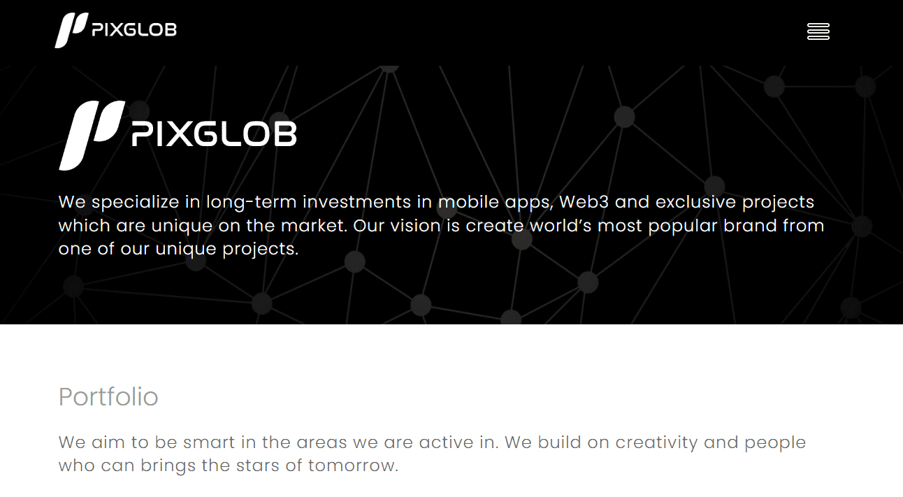

# PIXGLOB Coin

我们专注于对市场上独一无二的移动应用程序、Web3 和独家项目的长期投资。我们的愿景是通过我们独特的项目之一创建世界上最受欢迎的品牌。 

我们的目标是在我们活跃的领域变得聪明。我们建立在创造力和能够带来明日之星的人之上。

世界已经为一场历史性的事件做好了准备——一些激动人心的、大型的、国际的、国家的、特别的，一些还没有发生过的事情。

什么是 PIXGLOB 币？

PIXGLOB Coin 是一个 NFT（不可替代代币）集合。存储在区块链上的数字艺术品集合。

有多少 PIXGLOB Coin 代币？

总共有 2 个 PIXGLOB Coin NFT。目前 2 位所有者的钱包中至少有一个 PIXGLOB Coin NTF。

