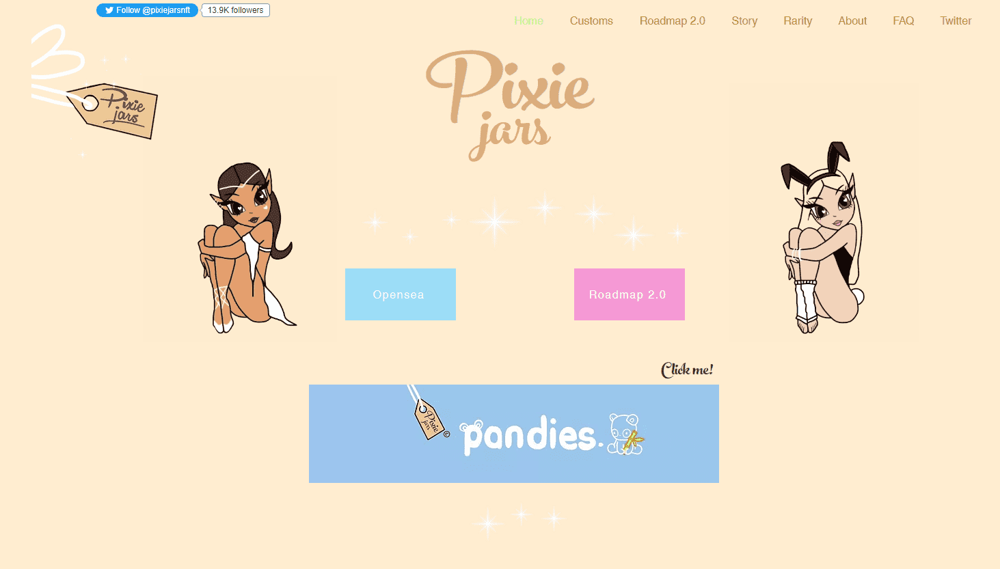

# Pixie Jars Rewards

Pixie Jars Rewards 是 Pixie Jars Main Collection 持有者独有的独家收藏。

Pixie Jars Rewards NFT 在过去 7 天内售出 9 次。Pixie Jars Rewards 的总销售额为 324.24 美元。Pixie Jars Rewards NFT 的平均价格为 36 美元。有 528 个 Pixie Jars Rewards 所有者，总共拥有 22 个代币。

##### ▶ 什么是 Pixie Jars 奖励？

Pixie Jars Rewards 是一个 NFT（不可替代令牌）集合。存储在区块链上的数字艺术品集合。

##### ▶ Pixie Jars 奖励的费用是多少？

在过去 30 天里，最便宜的 Pixie Jars Rewards NFT 销售额低于 5 美元，最高销售额超过 63 美元。在过去 30 天内，Pixie Jars Rewards NFT 的中位价格为 23 美元。

