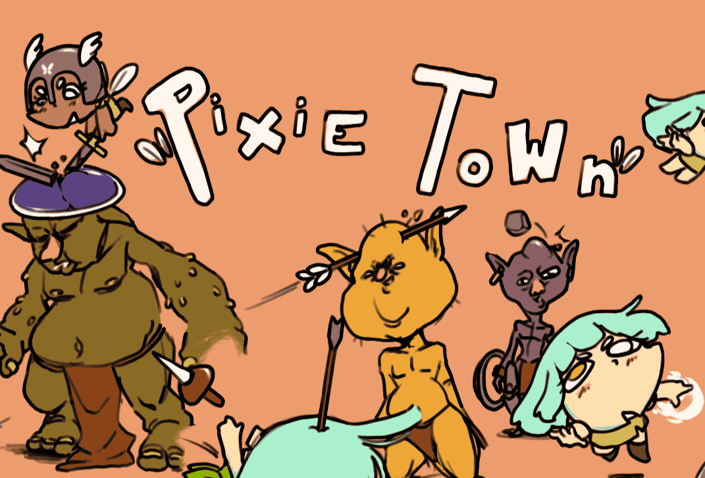

# pixietownwtf

首先，Goblintown.wtf 是 10,000 个 NFT 的集合，其中包含您可能认为存在于 Goblin Town 中的各种难看的生物。 这可以是巨魔、龙、巫师、蚊子和凯文。 是的，你没听错，凯文也是哥布林镇的。

毫无疑问，每个 Goblintown NFT 都有自己独特的特征和属性，其中 12 个是集合中的 1-of-1 NFT。 其中之一是 Goblin#8995（如上），昨天以 1.03 ETH（约 2,084 美元）的价格售出。 如果您准备好大饱眼福，请随意查看 Rarity Sniper 上最丑陋（也许也是最昂贵）的地精。

也许是一队哥布林？ 猜猜我们永远不会知道，因为 Goblintown.wtf NFT 的创建者都被取消了权限。 就此而言，这并不令人惊讶，因为大多数创始人在 NFT 项目的早期阶段将保持匿名。 鉴于此，我们只知道哥布林之王是在 OpenSea 上创建 NFT 集合的人。

