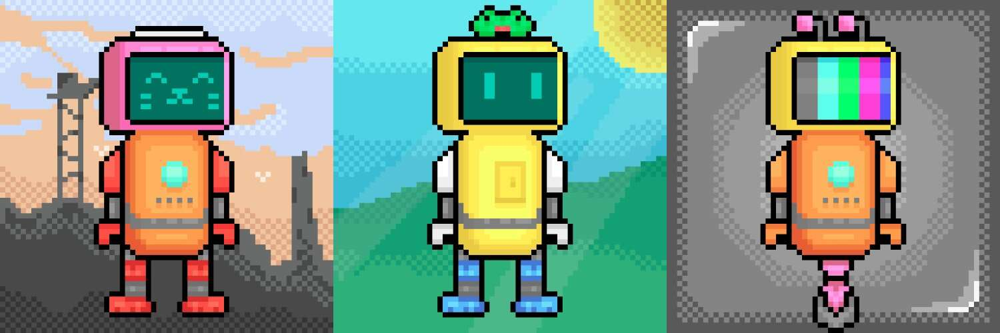

# PixoBots

PixoBots 是 3500 个不同的机器人，由 6 个类别中的 68 个不同部分随机生成，包括头、臂、腿、身体、配件和背景。每个零件在生成时都有不同的稀有度，以帮助创建独特的机器人集合！我们希望您喜欢它们！

每个机器人在生成时通过 Pinata 上传到 IPFS。我们将很快建立一个站点，以单独链接到它们。如果您在我们设置链接之前想要该链接，请随时在 Twitter 或 Discord 上给我们留言！

