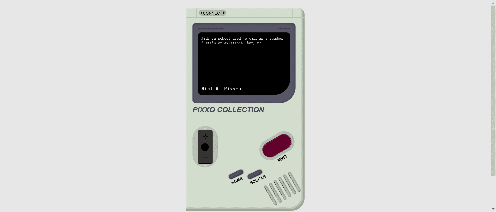

# Pixxo

学校里的孩子们曾经称我为污点。存在的污点。但是，现在不是了。我是 Pixxo，我已经准备好！在区块链上转换成 4444 个头像。我想在太空中结交新朋友，所以免费铸造我，只需支付 GAS！路线图显示为 100%。

▶ 什么是 Pixxo？
Pixxo 是一个 NFT（不可替代代币）集合。存储在区块链上的数字艺术品集合。

▶ 有多少 Pixxo 代币？
总共有 4,444 个 Pixxo NFT。目前，360 所有者的钱包中至少有一个 Pixxo NTF。

