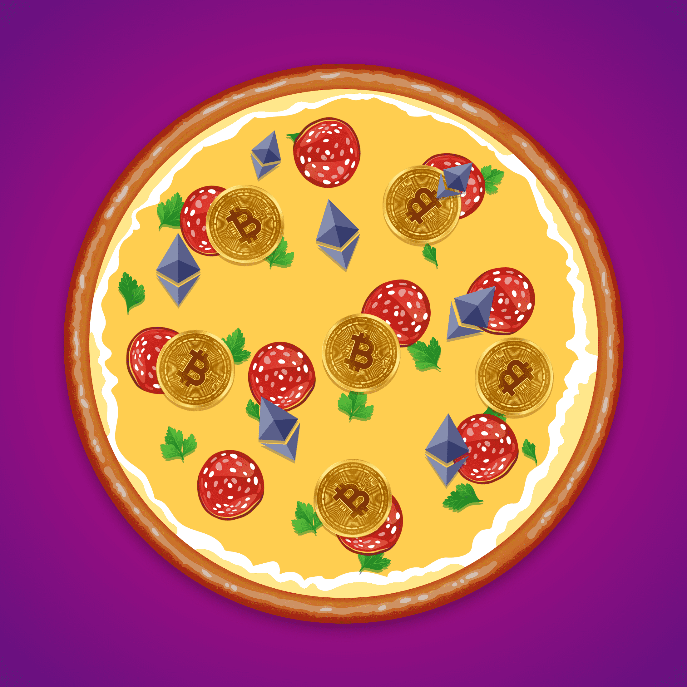

# 1111 Pizzas

1111 比萨饼统计
创建于 4 个月前
1,111 代币供应
2.5% 费用
过去 7 天内没有售出 1111 个披萨。

1111 Pizzas --- 1111 Pizzas 是生活在 Polygon 区块链上的 1,111 个独特的 Crypto Pizzas 的集合。--- 通过从同一个外壳中收集所有比萨，您将收到一个神秘的比萨盒！--- 确保您的观察列表中有此收藏。
▶ 什么是 1111 比萨？
1111 Pizzas 是一个 NFT（非同质代币）集合。存储在区块链上的数字艺术品集合。
▶ 1111 Pizzas 代币有多少？
总共有 1,111 1111 Pizzas NFT。目前，51 位业主的钱包中至少有一个 1111 Pizzas NTF。
▶ 最近卖出了多少 1111 Pizzas？
过去 30 天内售出了 0 1111 个 Pizzas NFT。

