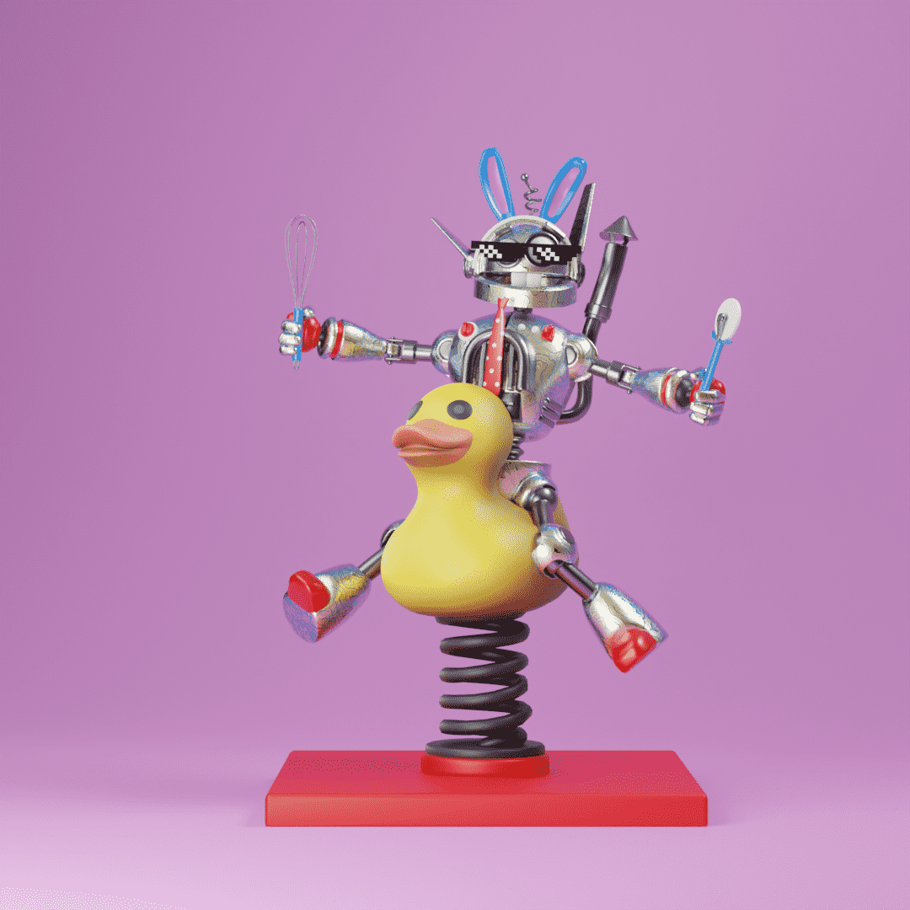

# PizzaBot

弃。止赎。流离失所。这就是比萨先生著名的街机餐厅的命运。一个有趣的房子变成了绝望。但就在这时，奇迹发生了。在洪水、雷鸣和闪电的夜晚，一道闪电击中了建筑物，使建筑物比以前更糟。或者我们认为……
‍
那个螺栓给了一个小机器人希望，他第一次意识到自己是清醒的，因此 PizzaBot 还活着！从他最喜欢的游戏中取出零件后，PizzaBot 意识到他是第一个，一个有情众生，他必须为他的同类获得生存权。上诉法庭，一个又一个法庭，直到他被授予公民身份！现在，3 年后，PizzaBot 有了 3 个人生目标。 1. 提供高效制作的最佳披萨。 2.创造更多PizzaBots，希望能找到其他的知觉！ 3. 让比萨先生的街机重现昔日辉煌！
‍
有了这 6,969 件收藏品，您可以帮助 PizzaBot 实现他的目标，并在 Metaverse Mr. Pizza Arcade 中享受他的劳动成果！

