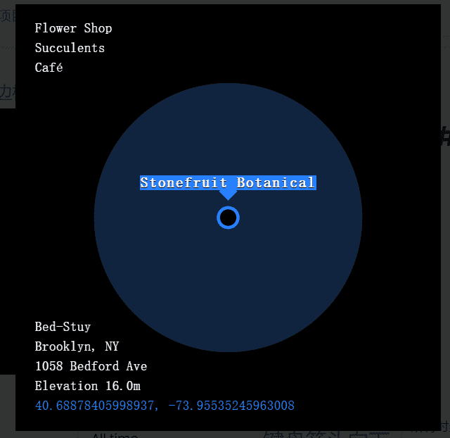

# Places (for Everyone)

Places 是一项在以太坊区块链上将地理位置建立为 NFT 的实验。该项目旨在管理由我们的社区提交和验证的不断增长的特定地点集合，以提供完全存储在链上的免费 (cc0) 可查询地点数据。
我们的第二次 Places drop 庆祝奥克兰市，在东湾充满活力的社区和社区中发现了 500 个独特的地点。这一下降包括 Temescal Alley、Oakland Arena、Fruitvale 的 Hasta Muerte Coffee 和伯克利的 Guerilla Cafe 等地方。在你造币之前，你不会知道你要去哪个地方。

请记住，Places 仍然是一项实验。合同未经审计。您不必在或从投放区到薄荷糖。薄荷糖需您自担风险。玩得开心。如果它不好玩，就不要这样做。

