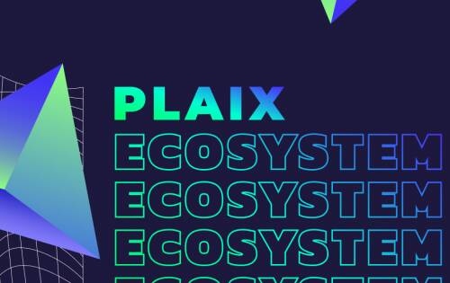
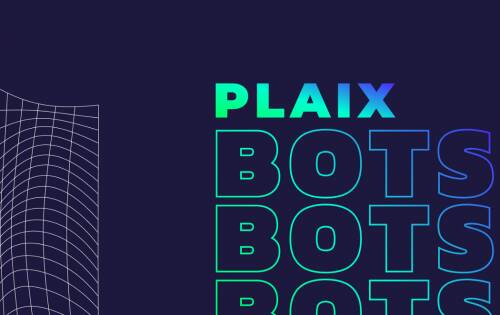
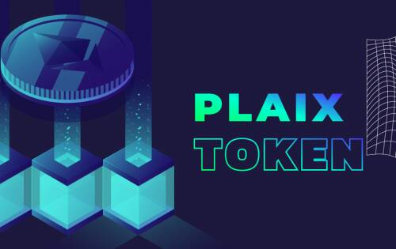

# PLAIX

PLAIX 是一个基于区块链的生态系统，面向社区、影响者、品牌创造者、流行游戏玩家等，以实现社区元界的流动性。PLAIX 可以将社区提升到一个新的水平。

它为用户提供各种数字服务。使用 PLAIX 工具的社区可以：

创建社区拥有的数字资产。

奖励他们的社区并从中获利。

发展更好的参与度。

启动智能合约。

为社区和混合资产启动质押。

从投资者或去中心化协议那里获得流动性。

PLAIX 生态系统由不同的产品组成，涵盖社区发展和成长的主要需求。它包括访问数字资产的机器人、社区管理仪表板、用于创建游戏内社区资产的 GameFi 产品、集成外部开发的桥梁，以及将进一步描述和开发的更多内容。看看 PLAIX 生态系统的这种结构

