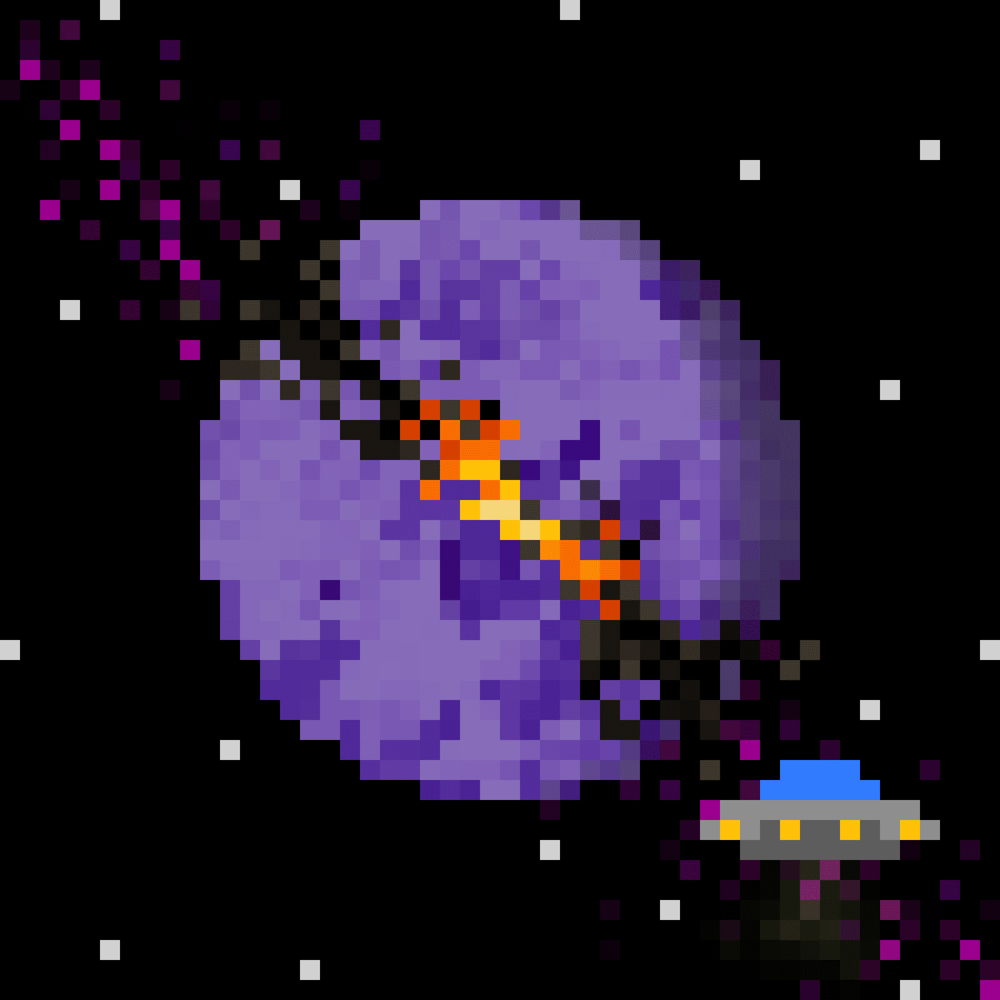

# Plan8ts

Plan8ts 是多边形网络上 8008 个随机生成的 8bit 行星的集合。现在丢弃 1 个，400 个行星，0.001 eth

每次下跌后价格都会上涨，所以尽早获得最大的利润！

持有人将获得 30% 的初级销售额和 100% 的特许权使用费。

Plan8ts 网站 1.0 即将推出。

8008 个在多边形上随机生成的 8 位行星。 🌍💫
现在在 Opensea 上提供前 400 个 plan8ts
🚀🚀Drop 1 现已在 opensea 上架！ 🌍🎉

多边形上 400 个 plan8ts (0.001 eth)
链接在 bio ⬆️🚀 我最喜欢的几个 plan8ts 仍然可用
@外海

