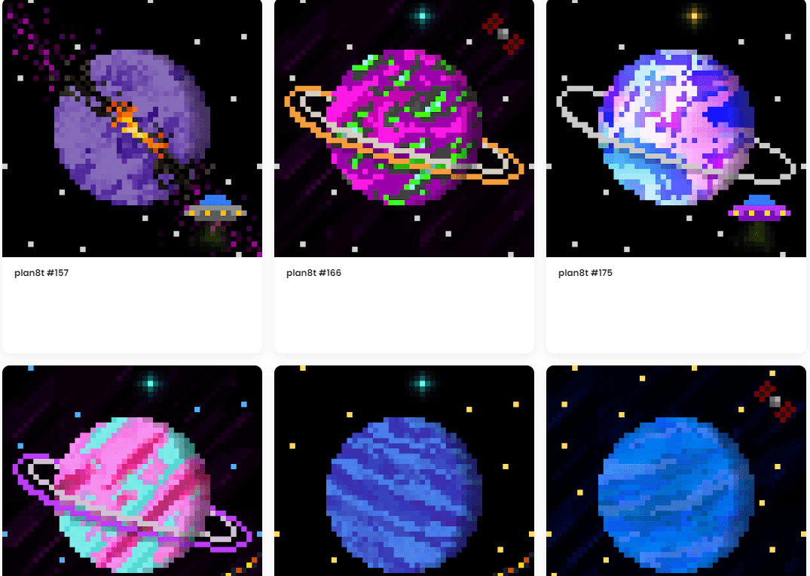

# Plan8ts

8008 个在多边形上随机生成的 8 位行星。现在在 Opensea 上提供前 400 个 plan8ts

Drop 1 现在可以在 opensea 上使用！400 plan8ts on polygon (0.001 eth) 生物链接

看看我们在 opensea 上的第一滴 400 plan8ts。只有 0.001 eth。价格将在下一次下跌

为庆祝我们的第一次掉落，我们可以赢取赠品3 个 plan8ts！进入： 转推喜欢
在 12 月 1 日下降当天宣布的获胜者。 

又一次偷看其中一个独特的传奇 plan8ts。这个将在 drop 1

