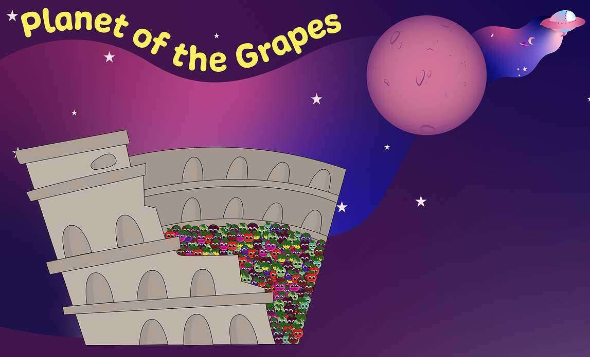

# Planet of the Grapes

Web3 动画系列和基于数字资产的社区。我们在 BingeBuilder 的团队培育了一个种子想法：一个基于故事的生成 NFT 游戏，您可以在其中加入 POTG 并用它来与社区互动。这是官方的 BingeBuilder NFT 合集。

一个 web3 动画系列和创意社区。我们将把我们的动画节目发展成一个“Grapeverse”，您可以在其中利用您的 NFT 制作节目、漫画书或玩生成游戏。购买葡萄即表示您允许种植我们的知识产权。我们只要求您尊重我们关于内容使用和许可的社区准则

在宇宙的荒野中，有银河 GNz-11。只有一个行星能够维持生命存在。Serenas 1061，一颗充满异常的行星。在过去的 1000 年里，统治物种更广为人知的是 Vinteros。

