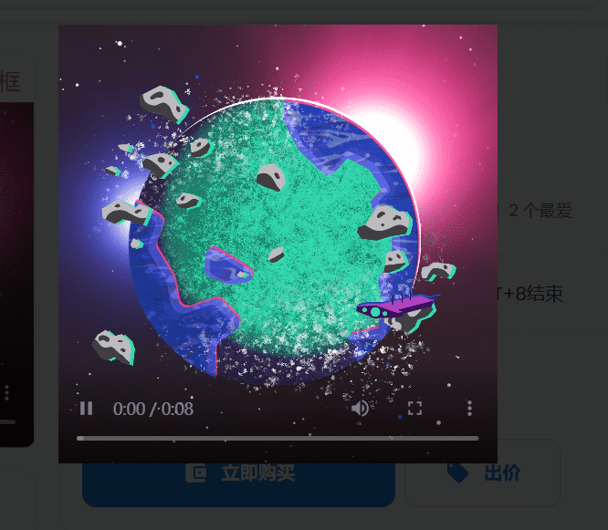

# Planet Pass

Planet Pass by Wanderers 统计数据
创建于 8 月前
6,899 代币供应
5% 费用
14,475 名 Discord 成员
35,525位推特关注者
Wanderers NFT NFT 的平均售价为 7 美元。Wander Planet Pass 在过去的 Wander Planet Pass 售价为 509.38 美元。Wanders Planet Pass 的平均售价为 2,931 美元。 6899个。

为您的 NFT 提供的 Web3 教程。免费玩开放的可互操作的故事生成器。快来了。

稀有度/网站/流浪者/流浪者

▶ 什么是流浪者的行星通行证？
流浪者的星球通行证是一个NFT（非质代币）集合存储。在区块链上的数字收藏品同系列。
▶ 有多少个Planet Pass by Wanderers 代币？
Wanderers NFT共有6,899个Planet Pass。目前，2,931位车主的钱包中至少有一张Planet Pass by Wanderers NTF。

