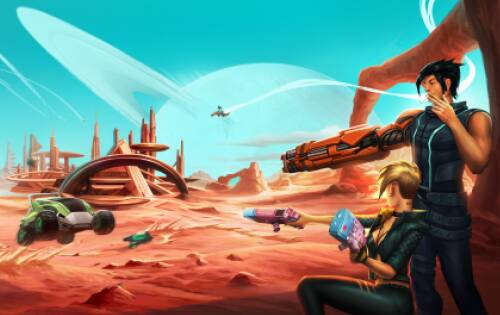
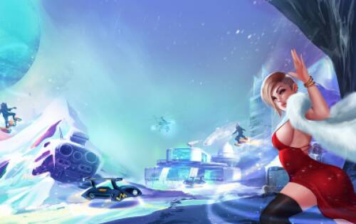
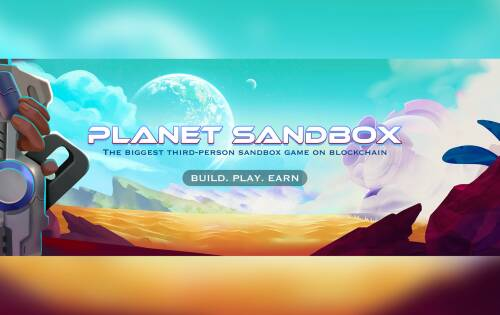

# Planet Sandbox

Planet Sandbox 是一款物理驱动的 NFT 沙盒射击游戏，允许玩家建造和拥有竞技场，使用自己的 NFT 武器和配件在不同的游戏模式下与其他玩家战斗。在 $PSB 和 $PULV 代币的支持下，Planet Sandbox 在他们的元界中创造了多个赚钱的机会。

例如，沙盒所有者可以使用无限的建筑物品自定义他们的土地，并设计游戏模式供其他人加入和玩。土地将成为玩家可以通过商店出售或赚取被动收入的业务。土地系统为创作者提供了多种可能性，可以在草地、沙漠、山脉、有毒荒地、北极等不同的风景和景观上进行构建。最终，游戏将包括其他行星环境。

除了建造者工具外，还有多人游戏模式，让玩家可以选择自己喜欢的沙盒，在激烈的格斗游戏（如死亡竞赛和狩猎道具）中与他人竞争以赢取奖品。该游戏的测试版预计将发布今年十一月。

是什么让 Planet Sandbox 与众不同

赋予玩家权力：我们提供工具，您可以建立自己的世界并统治您的游戏。

PlanetSandbox 是作为 Metaverse 开发的，具有即将推出的 AR/VR 集成功能。

多平台：游戏将首先推出网页版。根据路线图，移动/PC平台将于明年发布。

两个令牌：

 $PSB - 主要代币、治理代币、购买/出售 nft；- $PULV - 游戏代币、通胀代币、铸币/销毁。

