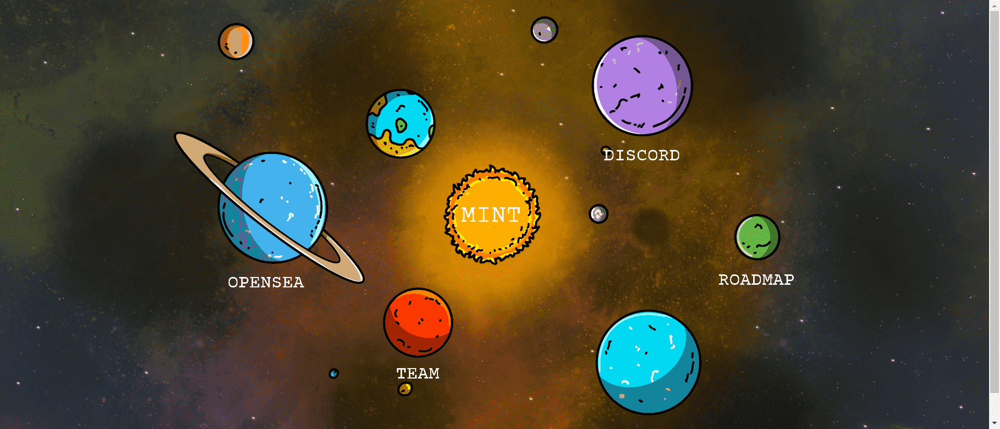

# Planet Seekers

12,000 个不同的行星 | 去你自己的🪐你能在那里生存吗？因为他们的居民并不总是友好的

▶ 什么是 Planet Seekers？
Planet Seekers 是一个 NFT（不可替代代币）集合。存储在区块链上的数字艺术品集合。

▶ Planet Seekers 代币有多少？
总共有 10500 个 Planet Seekers NFT。目前，5000 名所有者的钱包中至少有一个 Planet Seekers NTF。

