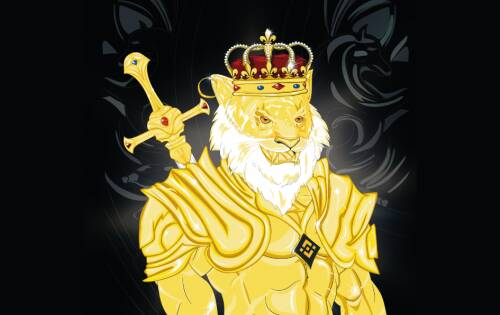
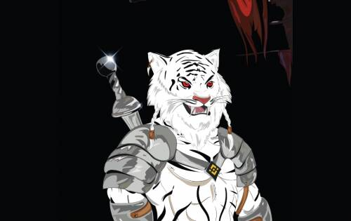
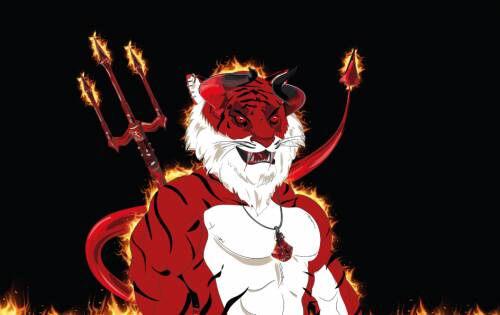

# Planet ZUUD : Tiger Warriors

Planet ZUUD 是一个新创建的世界，它将成为一系列手绘 NFT 收藏的舞台。它是根据故事情节设计的，该故事情节将涵盖在 ZUUD 星球上开发的所有 NFT 收藏。它可以在必要时扩展以支持未来的研究和项目。

“Planet ZUUD”将成为所有 NFT 系列和其他将在 Planet ZUUD 环境中进行的产品的主要品牌。

“Tiger Warriors”是第一个在 ZUUD 星球上设计和开发的 NFT 合集。它代表了虎族，其故事将成为 ZUUD 星球故事的第一部分。它是 2222 虎勇士的独特手绘集合。（图 2 中的示例）

每个 Tiger Warrior NFT 都有九 (9) 个属性。这些属性是：身体、布料、头部、项链、耳环、月份、眼睛、武器和背景。

Tiger Warriors NFT Collection 已在 BNBChain 上开发。

Tiger Warriors NFT Collection 遵循出处哈希解决方案，与主要 NFT 项目在实施 NFT 铸币厂时使用的黄金标准相同。

每个 NFT 图像首先使用 SHA-256 算法进行哈希处理。通过以特定顺序连接每个图像的 SHA-256 获得组合字符串。最终证明是通过 SHA-256 散列这个组合字符串获得的。这将是存储在智能合约中的最终出处记录。

有 2222 个独特的 Tiger Warriors NFT。2222 个 NFT 中的 9 个属性特征纯粹是独特的和定制的（1 个中的 1 个）。这 9 个 NFT 是“Unique Trait NFT”。剩余的 2213 个 NFT 是随机生成的。

