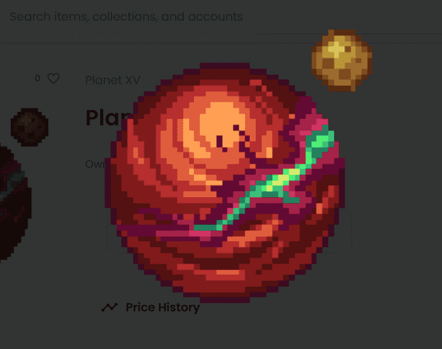

# Planet XV

XV 星统计数据
创建于 8 月前
1,111代币供应
7.5% 费用
1,767 名 Discord 成员
Planet XV NFT 7 7 今日公开的价格是Planet XV NFT 1过去的。 XV NFT 的总价格为4 7 0 X 过去。 XV NFT 的总价格为7美元XV过去的一个美元。Planet 1 平均拥有一个1代拥有一个。

111 星 XV 流畅在更新1链上！加入我们的 Discord 以获取最新！Building.......
▶ 什么是 XV 行星？
Planet XV 是 NFT（替代代币）集合。在区块链上存储一个不可收藏的收藏品。
▶ Planet XV代币有多少？
一个行星XV NFT1,11个车位。目前，47位主的钱包中至少有一个行星XF。
▶ 最昂贵的 Planet XV 销售是什么？
售出最贵的 Planet XV NFT 是 Planet X #423。它于 2022 年 6 月 30 日（2 个月前）以 0 美元的价格出售。

