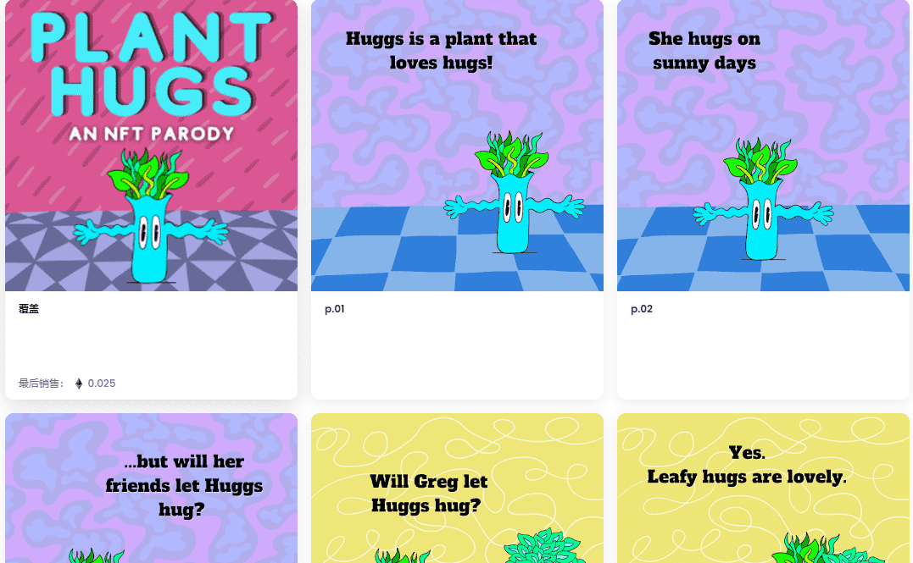

# Plant Hugs

这是一个分散的出版公司的创建，将 web3、社区和 IP 两个成功的部分结合在一起。目的是形成一个有才华的社区，通过将作品推向市场共同学习，利用彼此的优势，并从 web3 中获取 IP，最终成为一家成功的去中心化公司。

这一切都始于将NFT Parody (“Plant Hugs”) 这本书《植物拥抱》(Plant Hugs) 推向市场，供零售客户购买。Plant Hugs 是一本包含五个角色的儿童棋盘书，来自 NFT 收藏PlantSwap和Hilary Leung对Will Lady Bug Hug的模仿。

代表这本书的 NFT 将与用于出版和销售实体书的资金一起出售。Plant Hugs NFT 作为创世代币，优先参与未来的出版物，是建立去中心化出版公司的基础。

Plant Huggs NFT 系列中的故事板是起点。从那里开始，Plant Huggs 代币持有者将及时了解将这本书推向市场的最新情况，并有机会帮助指导运营、销售和营销方面的决策。

