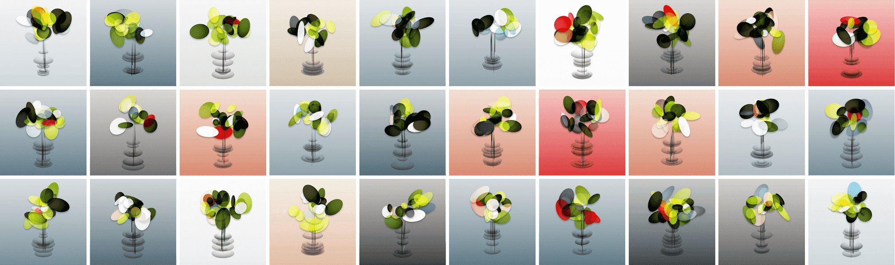

# Plant Voices

300 种植物声音由 Figma 算法程序生成，然后由艺术家 Joey Roth 修剪/策划

该系列将以 20 - 50 种新植物的形式发布。每一滴将根据每个稀有级别的当前市场价格进行定价。

每次掉落都会显示新的几何形状、纹理和配色，但高级特质稀有度框架将保持一致。

所有掉落物都将由 Manifold 合约预先铸造，并在 opensea/lookrare/rarible 上发布。收藏家会选择吸引他们的植物；没有彩票式的盲铸。

