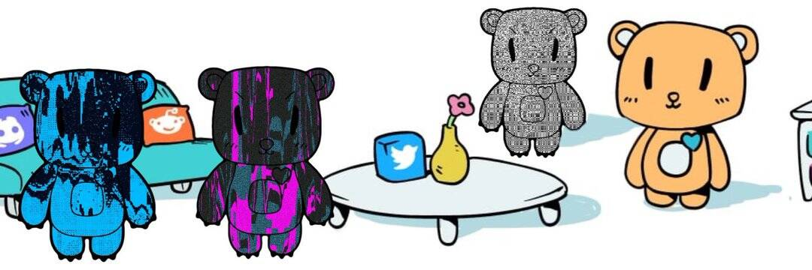

# Plasma Bears

Plasma Bears 是一款关于收集、建造和冒险的游戏。但是，该项目在 Loom 侧链上运行并已停止。Blockade Games 可能会重振该项目，但目前这些熊的部分是过去的收藏品。

你会想要收集尽可能多的强大、华丽和有趣的熊零件，以便将它们组装成踢屁股的等离子熊。一旦您手头有一只很棒的熊，您就可以带它们冒险寻找更多的战利品和宝藏。然后，您可以建造更不可思议的熊！

Plasma Bears 曾经在 Loom Network 侧链上运行。但是，该服务已停止。结果，许多熊的部分丢失了。用户可以将他们的熊和零件转移到以太坊以保存在自己的钱包中，但失去了玩的能力。现在游戏结束了，空头仍在以太坊上。 

以太坊上只剩下 1503 个熊部分或熊。这些文物现在被认为是有价值的，因为等离子熊是此类项目中的首批项目之一。 

或在 OpenSea 的开放市场上进行易货交易。当您的熊和零件在以太坊上时，您将无法在游戏中使用它们，并且当您准备再次与它们一起玩时，您需要将它们转回您的帐户。
