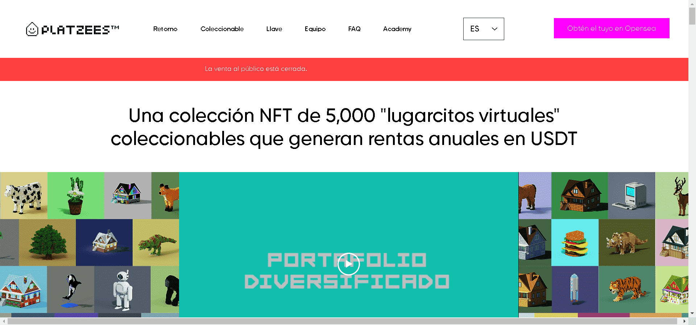

# Portafolio Diversificado Platzees

5,000 套虚拟房屋的集合，每年以 USDT 支付股息，这些股息来自我们在美国的房地产投资组合的美元租金收入。

Portafolio Diversificado由 Rodrigo Blanco 和他的妻子 Luisa de Blanco 在危地马拉充满爱意地创立，这是一个基督教婚姻，相信可以在拉丁美洲创造出让全世界享受的伟大事物。

我们深深感谢所有让这一切成为可能的团队成员、投资者和合作伙伴。我们希望您喜欢我们一直在努力开发的产品。

