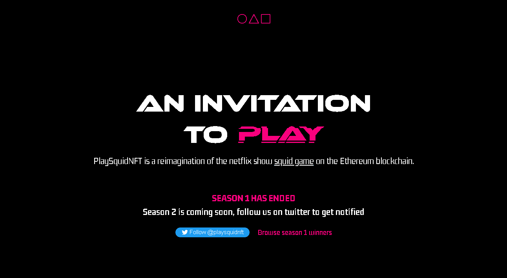

# Play Squid ART

PlaySquidArt 是 PlaySquidNFT 与各种艺术家合作的集合。

PlaySquidNFT 是对以太坊区块链上的 netflix 秀鱿鱼游戏的重新构想。

▶ 什么是 Play Squid ART？
Play Squid ART 是一个 NFT（非同质代币）集合。存储在区块链上的数字艺术品集合。

▶ 存在多少个 Play Squid ART 代币？
总共有 1 个 Play Squid ART NFT。目前，1,917 位所有者的钱包中至少有一个 Play Squid ART NTF。

