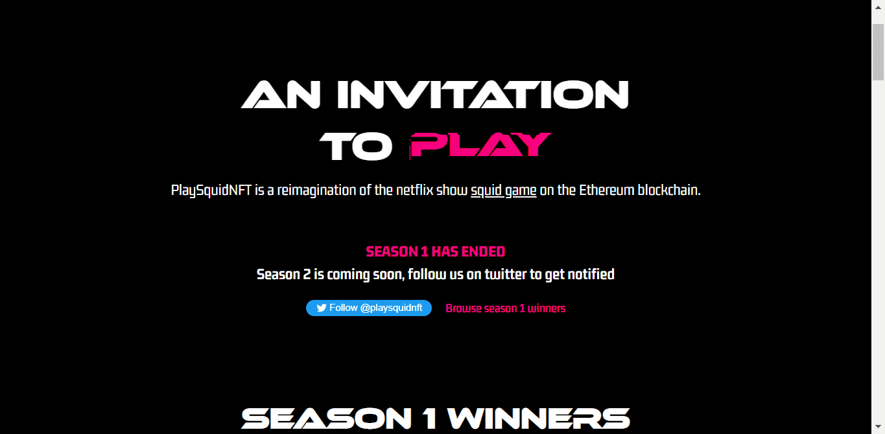

# Play Squid NFT

laySquidNFT 是对以太坊区块链上表演鱿鱼游戏的重新构想。拥有 5,740 个 PlaySquidNFT 代币中的一个会自动为您注册所有游戏，如果您能在所有游戏中幸存下来，您就有机会赢得最终奖品……PlaySquidNFT 不隶属于该节目。

▶ 什么是 Play Squid NFT - 必须阅读说明？
Play Squid NFT - 必读说明是一个 NFT（不可替代令牌）集合。存储在区块链上的数字艺术品集合。
▶ 存在多少 Play Squid NFT - 必须阅读说明令牌？
总共有 5,529 个 Play Squid NFT - 必须阅读 NFT 说明。目前，1,899 位所有者至少拥有一个 Play Squid NFT - 必须在他们的钱包中阅读 NTF 描述。
▶ 最近售出了多少 Play Squid NFT - 必读说明？
有 0 个 Play Squid NFT - 必须阅读过去 30 天内售出的 NFT 描述。
▶ 什么是流行的 Play Squid NFT - 必须阅读说明替代品？
许多拥有 Play Squid NFT 的用户 - 必读说明 NFT 还拥有 Moon Kongz 测试、 Lucky Teacup Piggy Club、 Loser Ape Club Official和 SEKUSHI GIRLS。

