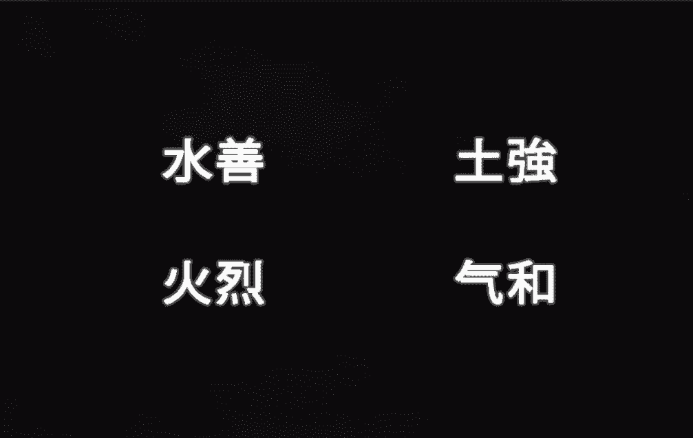

# Avatar - playBenders

▶ 什么是 Avatar - playBenders？
Avatar - playBenders 是一个 NFT（不可替代令牌）集合。存储在区块链上的数字艺术品集合。

▶ 存在多少 Avatar - playBenders 代币？
总共有 2,005 个 Avatar - playBenders NFT。目前，226 位所有者的钱包中至少有一个 Avatar - playBenders NTF。

▶ 最近卖出了多少 Avatar - playBender？
过去 30 天内共售出 0 个 Avatar - playBenders NFT。

▶ 什么是流行的 Avatar - playBenders 替代品？
许多拥有 Avatar-playBenders NFT 的用户还拥有 INKredible Squids Official、 Snapshots of Sydney、 DoolittlesNFT和 Stranger EggZ。

