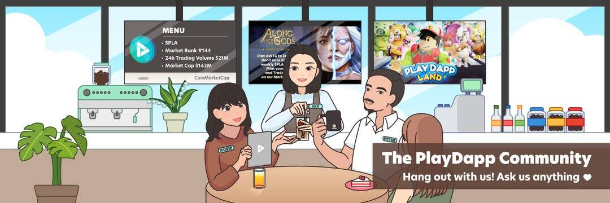

# PlayDapp Marketplace

PlayDapp MarketPLAce 是一个 C2C 市场，您可以在其中轻松买卖 NFT（非同质代币）游戏物品和其他基于区块链的数字资产，专注于奖励和支持开发者和玩家。所有 PlayDapp 游戏都是可互操作的，因此提供了您可以使用 NFT 享受的游戏内容组合。

除了通过升级、强化和合并来增加 NFT 的价值之外，您还可以在 C2C 市场中交易他们的角色和物品。PlayDapp 的愿景是创造一个数字资产更有价值且人人都可以访问的世界。您不仅可以第一次真正拥有他们的游戏内资产，还可以获得参与生态系统的奖励。
