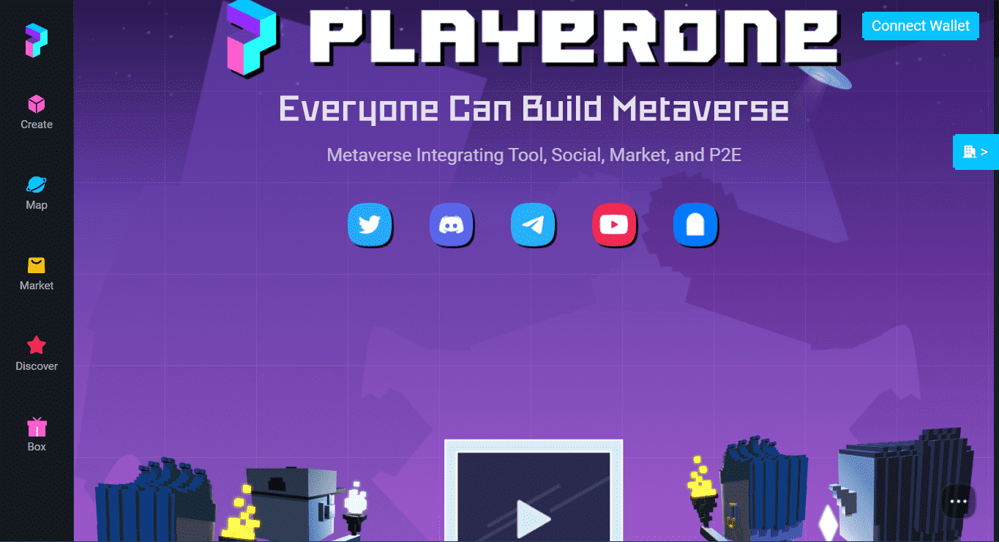

# PlayerOne Blueprint

蓝图神秘盒是专为《出埃及记》打造的礼物。官方首发蓝图有六种类型:现 代、希腊、地中海、哥特式、罗马式和洛可可式。收到蓝图后,用户可以在地 块编辑器中将蓝图绑定到土地上。
机体会根据人物的种类分为不同的稀 有等级。种类越稀有,身体的价值就 越高。
PlayerOne角色不会出售,仅基于角色 零件NFT的组合
用户在RoleEditor中完成角色匹配后, 一键上链,角色属性也同时上链
PlayerOne不仅包含虚拟社交,还
包含宠物养成和Play to Earn,让 你边玩边赚
PlayerOne支持跨平台使用, web、Windows、Mac、 Android、iOS均可体验丰富内容

