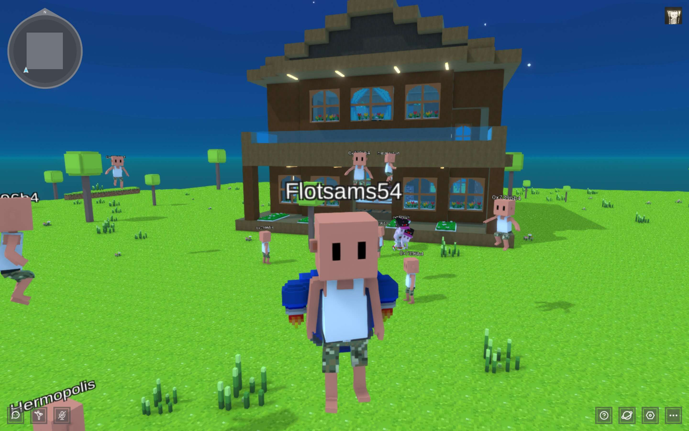

# PlayerOne MintPass

PlayerOne MintPass 是薄荷 PlayerOne Parcel 销售的门户。 MintPass 分别分为四个区域：MintPass 10 x 10、MintPass 20 x 20、MintPass 30 x 30、MintPass 40 x 40。您购买土地的大小将由 MintPass 的面积决定。

空间编辑器是一个完全免费且易 于使用的元界空间编辑器。创建你自己的虚拟世界建筑并邀请朋友一起玩，将建筑物发布到您的土地并享受元宇宙的生活方式

展示您的 NFT 的
3D体验
艺术家和收藏家在完全沉浸式体验中免费展示其 NFT 的最简单方式。

