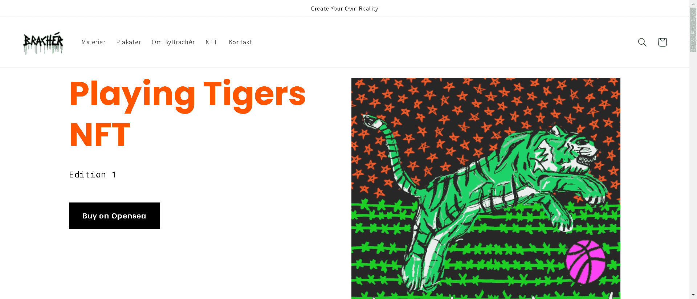

# Playing Tigers Edition 1

Playing Tigers Edition 1 是一个包含 220 个 NFT 的集合，展示了 11 种独特的设计，其中 20 种是“稀有”的，这给它们带来了更多的现实世界的好处。所有设计均由 Martin Brachér 创作和设计。Playing Tigers NFT 的每个元素都是手工绘制和绘制的。

丹麦艺术家 By Brachér 设计并创造了一个加密世界，它结合了数字世界和物理世界。Playing Tigers 是一个适合所有喜欢突破界限和探索新机会的人的项目。欢迎来到玩老虎。

这些作品由以太坊区块链保护并托管在 IPFS 上。

