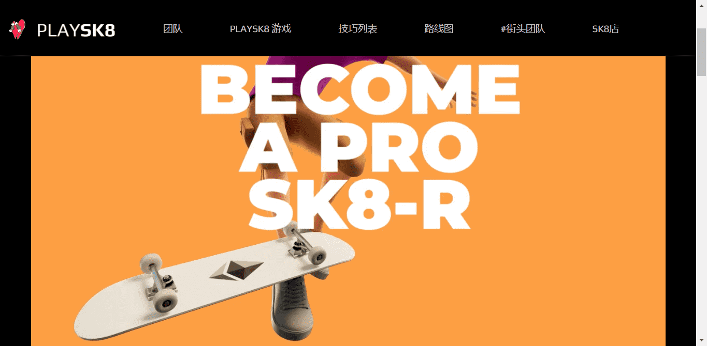

# PLAYSK8 Mint

PLAYSK8 游戏发布

 在 SK8 游戏中对战玩家

通过登陆技巧训练你的 SK8r

进化你的 SK8r 以学习新的技巧

在排行榜上累积积分 + 赢奖品

 SK8 进入元界

 PLAYSK8 在我们的合作伙伴 ReadyPlayerDAO 的帮助下滑入元界，他们在沙盒中为我们建造了一个 SK8 公园！

 SK8 聚会 IRL

 派对、活动、滑板公园课程等。

SK8游戏
PLAY SK8是基于来自世界各地的滑板手所玩的经典游戏 SKATE 

1) SK8 游戏中的对战玩家。

2) 翻转虚拟硬币，看谁先走。

3) 玩家一将选择他们的SK8 r 并部署任何解锁的 Trick 来开始游戏。

（ 诀窍要么落地，要么失败

基于其分配的概率）。

4) 如果 Trick Lands ，玩家二必须完成相同的 Trick，否则他们会收到一封信。

5) 如果玩家一的技巧失败，那么玩家二 可以部署任何技巧。

（防守方SK8 r可以使用锁定的技巧，但是落地概率会降低到 5% ）。

6）第一个拼出SK8的玩家，输了。

