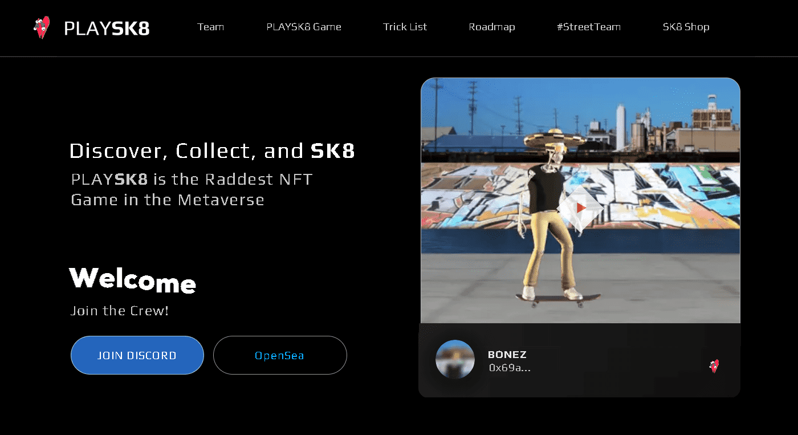

# PLAYSK8

Metaverse 中最热门的 NFT 游戏🤘🛹🚀

▶ 什么是PLAYSK8？
PLAYSK8 是一个 NFT（不可替代代币）集合。存储在区块链上的数字艺术品集合。

▶ PLAYSK8 代币有多少？
总共有 3,000 个 PLAYSK8 NFT。目前 1,242 位所有者的钱包中至少有一个 PLAYSK8 NTF。

▶ 最贵的 PLAYSK8 销售是什么？
出售的最昂贵的 PLAYSK8 NFT 是 SK8R #00511。它于 2022-06-27（2 个月前）以 54.9 美元的价格售出。

▶ PLAYSK8最近卖了多少？
过去 30 天内售出了 9 个 PLAYSK8 NFT。

