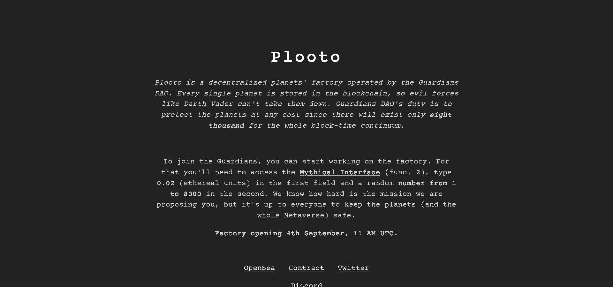

# Plooto

Plooto 是一个链上工厂，用于创建受 Guardians DAO 保护的独特行星。随意以任何你想要的方式使用你的行星。

Plooto 是由 Guardians DAO 运营的去中心化行星工厂。每个星球都存储在区块链中，因此像达斯维德这样的邪恶势力无法将它们摧毁。Guardians DAO 的职责是不惜一切代价保护行星，因为整个区块时间连续体将只存在八千。

要加入守护者，您可以开始在工厂工作。

