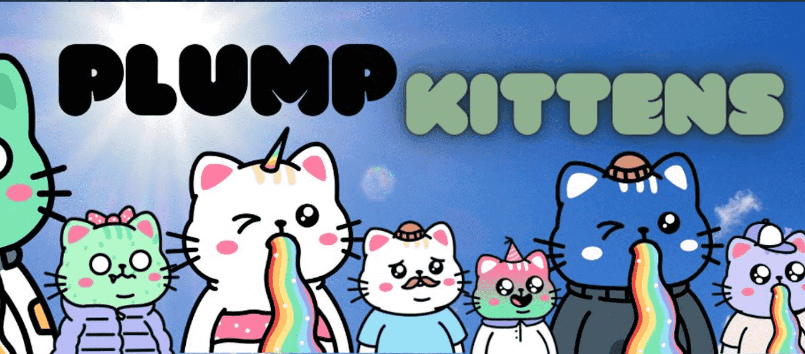

# Plump Kittens

进入绒毛巢穴需要您自担风险，因为这里可能太可爱了！

▶ 什么是丰满小猫？
Plump Kittens 是一个 NFT（不可替代代币）系列。存储在区块链上的数字艺术品集合。

▶ 有多少 Plump Kittens 代币？
总共有 5,555 个 Plump Kittens NFT。目前，1,645 位业主的钱包中至少有一只 Plump Kittens NTF。

▶ 什么是最昂贵的 Plump Kittens 促销活动？
售出的最昂贵的 Plump Kittens NFT 是 #814。它于 2022 年 6 月 23 日（2 个月前）以 120.8 美元的价格售出。

▶ 最近卖出了多少只胖胖的小猫？
过去 30 天内售出了 45 个 Plump Kittens NFT。

