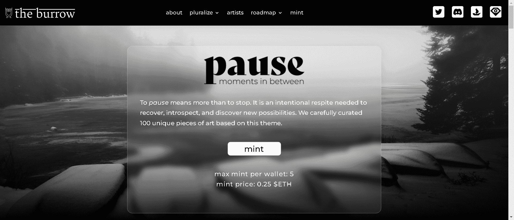

# Pluralize

复数意味着复数或以复数形式表达。这一系列照片旨在将相同的想法或信息与不同类型的摄影进行多元化。我们的目标是展示思想、过程和技术的多样性，都可以汇集在一起，以自己独特的方式讲述相似的故事。我们通过表达的统一来庆祝我们的多样性。

The Burrow 是一个南亚艺术家集体，其使命是让新兴艺术家在 NFT 空间中可见。我们的目标是通过Pluralize等基于主题的精选作品以及The Burrow Art Fund等倡议来关注新兴艺术家并为社区提供价值，其中智能合约和铸造 dApp 每月由集体全额赞助或补贴。

