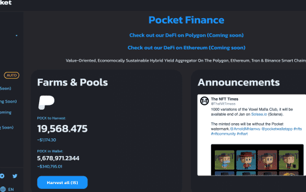

# Pocket Finance

Pocket Finance 于 2021 年 11 月推出，是一个加密产品生态系统，包括农场、矿池、保险库、套利交易、NFT 市场、DAO、预测市场、借贷协议，旨在创建一体化套件。

除此之外，Pocket 还拥有自己的加密钱包应用程序，与 Mercuryo 和 Changelly 集成。目的是为用户提供一个易于使用的钱包来访问它的 DeFi Suite（Pocket Finance）。虽然它的一些产品已经上线，但它的路线图看起来相当令人印象深刻。

POCK 代币由用户在参与所有质押活动时赚取，并可用于成功套利交易的佣金折扣。
