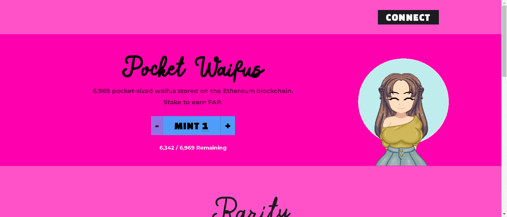

# PocketWaifus

6,969 个口袋大小的 waifus 紧凑地存储在区块链上，因此您永远不必失去她。

FAP 是一种算法稳定币，目标价为 0.69 美元。农业从 2021 年 10 月 19 日开始。

▶ 什么是袖PocketWaifus？
PocketWaifus 是一个 NFT（不可替代代币）系列。存储在区块链上的数字艺术品集合。

▶ 有多少 PocketWaifus 代币？
总共有 627 个 PocketWaifus NFT。目前，171 位所有者的钱包中至少有一个 PocketWaifus NTF。

