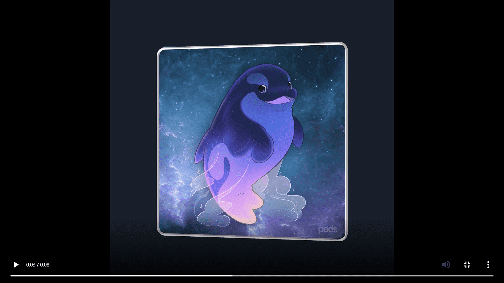

# Pods - The Awakening

很久以前，科学家们发现了一艘装满孵化器的不明飞船。在试图弄清楚这些物体的性质的许多尝试失败后，他们放弃了尝试。将近一百年后的一天，意想不到的事情发生了：孵化器开始亮起并且表现得很奇怪。那一天恰好是人类发现 DeFi 的那一刻。这只是巧合吗？这些事件完全不相关吗？我们会比我们想象的更早发现。我们相信，这些孵化器中的任何内容只有在任务完成时才会被披露，而第一个是 DeFi 的发现。现在轮到你完成这些最后的步骤并解锁里面的神秘生物了。祝你旅途愉快。
利用低风险受保护的保险库，以更少的开销获得更多收益。从 ETH 和期权开始。

Pods Yield 的第一个策略，stETHvv（以太坊波动率保险库）是专注于 ETH 增持的低风险产品。它将 Lido 的收益率与每周的扼杀相结合，每次 ETH 价格上涨或下跌时都能赚取更多收益。阅读更多。

