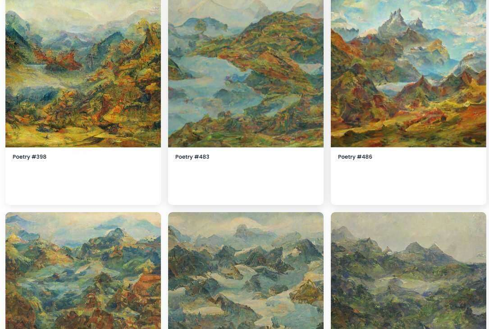

# Poetry Official

什么是诗官？

Poetry Official 是一个 NFT（Non-fungible token）集合。存储在区块链上的数字艺术品集合。

诗歌官方代币有多少？

总共有 501 个诗歌官方 NFT。目前 118 位所有者的钱包中至少有一个 Poetry Official NTF。

最昂贵的诗歌官方销售是什么？

最昂贵的 Poetry Official NFT 是 Poetry #324。它于 2022-06-12（3 个月前）以 7.3 美元的价格售出。

诗官最近卖了多少？

过去 30 天内共售出 5 个 Poetry Official NFT。

